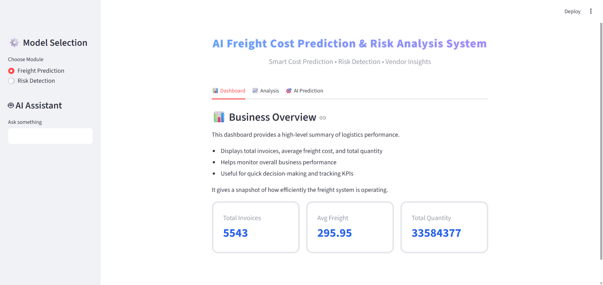
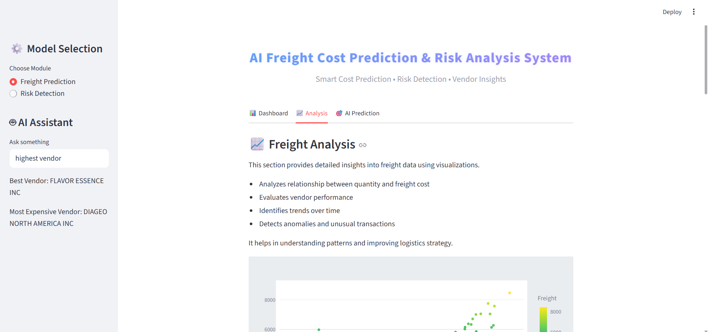
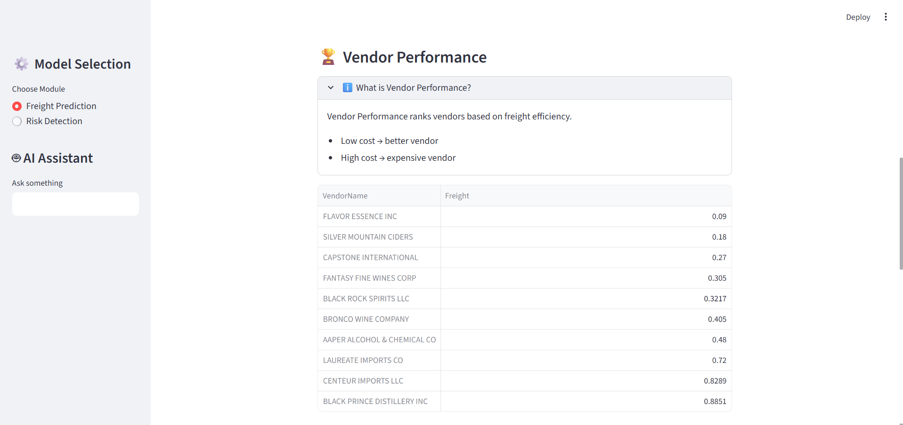
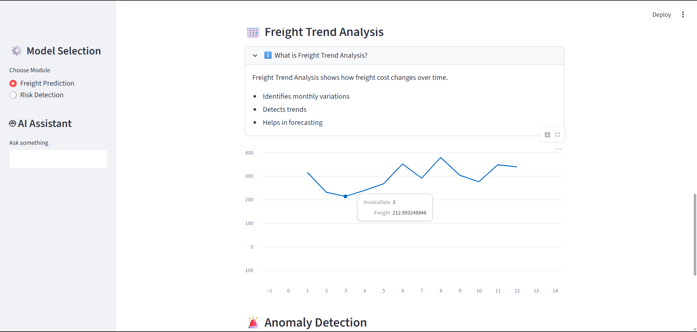
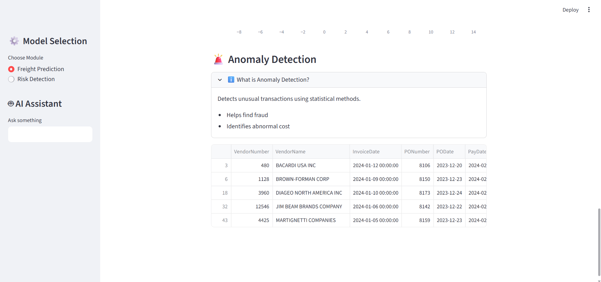
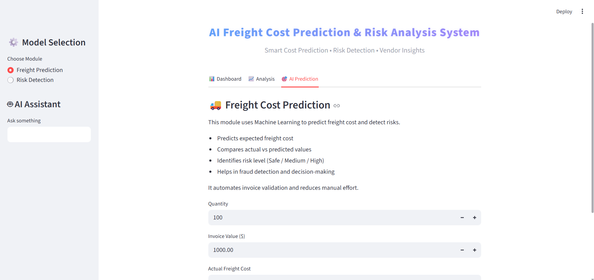
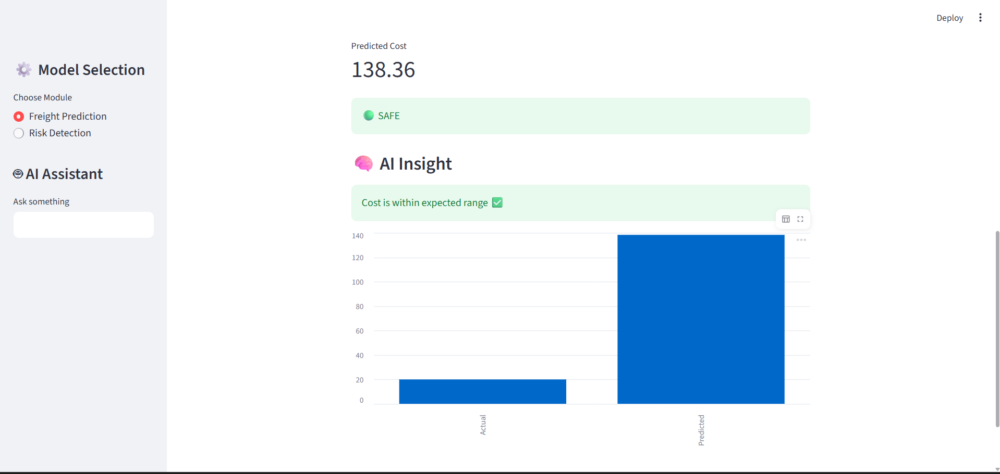
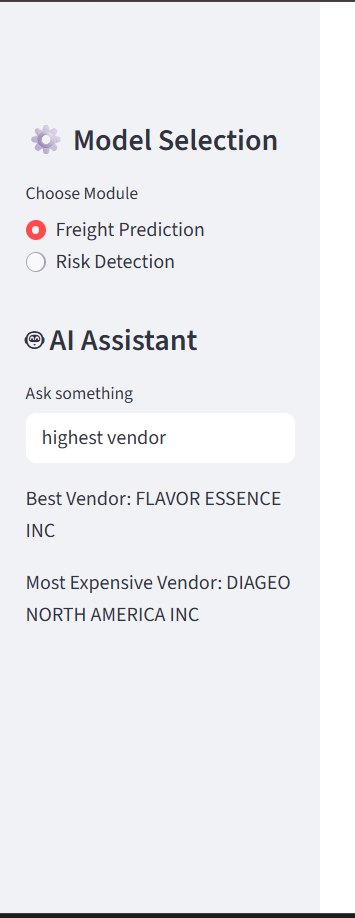

# 🚀 AI Freight Cost Prediction & Risk Analysis System

A machine learning-based web application that helps analyze freight costs, compare vendor performance, predict expenses, and detect risky invoices using interactive dashboards.

---

## 📌 Features

* 📊 Dashboard with key insights
* 📈 Freight trend analysis
* 🏆 Vendor performance comparison
* 🤖 Freight cost prediction
* 🚨 Risk detection system

---

## 🖼️ Application Overview

### 📊 Dashboard

<p align="center">
  
</p>

This page shows overall business insights like total invoices, average freight cost, and quantity.
It helps users quickly understand system performance.

👉 Built using: Pandas + Streamlit (columns & metrics)

---

### 📈 Analysis

<p align="center">
  
</p>

<p align="center">
  
</p>

<p align="center">
  
</p>

<p align="center">
  
</p>

This section displays graphs for freight trends and vendor comparison.
It helps in identifying patterns and unusual cost behavior.

👉 Built using: Pandas (groupby) + Plotly charts

---

### 🎯 Prediction & Risk Detection

<p align="center">
  
</p>

<p align="center">
  
</p>

Users enter inputs like quantity and invoice value.
The system predicts freight cost and classifies risk as Safe / Medium / High.

👉 Built using: Scikit-learn model + Joblib

---

### ⚙️ Model Selection & AI Assistant

<p align="center">
  
</p>

This section lets users choose between **Freight Prediction** and **Risk Detection**.

It also includes an AI assistant where users can ask queries like *highest vendor* or *most expensive vendor*, and get instant insights.

👉 Built using: Pandas + Streamlit


## ⚙️ How It Works

* Data is processed using Pandas
* Features like cost ratio and deviation are created
* ML model predicts freight cost
* Risk is calculated based on difference
* Results are displayed using Streamlit

---

## 🛠️ Tech Stack

* Python
* Streamlit
* Pandas
* NumPy
* Scikit-learn
* Plotly

---

## ▶️ Run Locally

```bash id="1q9zkl"
git clone https://github.com/vritikavashisth/AI-Freight-Cost-Prediction-Risk-Analysis-System.git
cd AI-Freight-Cost-Prediction-Risk-Analysis-System
pip install -r requirements.txt
python -m streamlit run app.py
```

---

## 🌐 Live Demo

https://ai-freight-cost-prediction-risk-analysis-system-ipztyoxfkebtfb.streamlit.app

---

## 👤 Author

Vritika Vashisth

---
